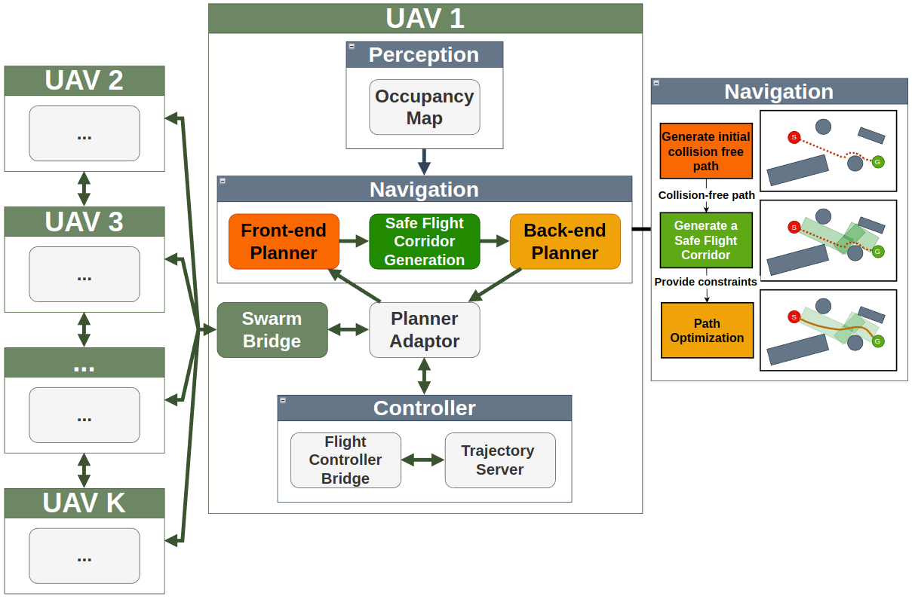

# gestelt
A swarm framework with a focus on simulating multi-UAV navigation in cluttered environments. 
For simulation and deployment on a physical drone, PX4 is the firmware of choice, although it is possible to remap the topics for use with Ardupilot or any other Mavlink-compatible system.


# Architecture


## Navigation module
The navigation module comprises the front-end planner, safe flight corridor generation and back-end planner. The front-end planner utilises either a search-based or sampling-based algorithm to plan an initial collision-free path from a given starting point to the goal position. Then, the front-end path acts as a reference for safe flight corridor generation, similar to what has been done in \cite{liu2017sfc}. Finally, the front-end path and the safe flight corridor are given as an initial guess and constraint respectively to the back-end optimizer. 

## Perception module
The perception module provides a three-dimensional voxel grid map that is queried by the navigation module for collision checking. Map construction is performed using the probabilistic mapping method with point cloud input from either a simulated or actual sensor. The use of voxels lends itself to efficient nearest neighbour queries using KD-Trees, which is crucial for collision checking in path planning algorithms. Voxel representation utilises the Bonxai library , a lightweight and performant hierarchical data structure influenced by OpenVDB.  

## Controller module
The controller module is a state machine controlling the flow between different low-level flight states such as taking off, landing, emergency stop and mission mode. Additionally, it converts trajectories from the navigation module and converts it to positional/velocity/acceleration command inputs for execution

## Planner adaptor
The last module, planner adaptor, acts as an abstraction layer between the controller and navigation module. This is useful because existing available planners can be integrated without any heavy modification. The only requirement is to establish a set of ROS message interfaces between the planner and planner adaptor, thereby treating the planner module as a black box. 

# Dependencies
1. ROS Noetic 
2. Ubuntu 20.04

# Installation and Setup for Simulation
1. Install dependencies
```bash
# Install ROS (if not done)
sudo apt install ros-noetic-desktop-full

# Install other dependencies
sudo apt install git build-essential tmux python3-catkin-tools python3-vcstool xmlstarlet -y
sudo apt install ros-${ROS_DISTRO}-mavlink ros-${ROS_DISTRO}-mavros ros-${ROS_DISTRO}-mavros-msgs ros-${ROS_DISTRO}-mavros-extras -y
# For vicon package
sudo apt-get install ros-noetic-vrpn-client-ros
```

2. Clone third party repositories
```bash
mkdir -p ~/gestelt_ws/src/
cd ~/gestelt_ws/src
git clone https://github.com/JohnTGZ/gestelt.git -b master
cd gestelt
vcs import < simulators.repos --recursive
vcs import < thirdparty.repos --recursive
```

3. Install PX4 firmware
```bash
# cd to PX4-Autopilot repo
cd ~/gestelt_ws/PX4-Autopilot
bash ./Tools/setup/ubuntu.sh 
# Make SITL target for Gazebo simulation
DONT_RUN=1 make px4_sitl gazebo-classic

# Copy the custom drone model over
cp -r ~/gestelt_ws/src/gestelt/gestelt_bringup/simulation/models/raynor ~/gestelt_ws/PX4-Autopilot/Tools/simulation/gazebo-classic/sitl_gazebo-classic/models/

# [EMERGENCY USE] IF you screw up the PX4 Autopilot build at any point, clean up the build files via the following command:
make distclean
```

4. Building the workspace
```bash
# Assuming your workspace is named as follows
cd ~/gestelt_ws/

# Building for debugging/development
catkin build
# Building for release mode (For use on Radxa)
catkin build -DCMAKE_BUILD_TYPE=Release
```

# Quick start

## 0. Configurations
1. The primary planner configuration file is [navigator.yaml](/home/john/gestelt_ws/src/gestelt/gestelt_bringup/config/navigator.yaml). We can choose between 3 different planner configurations, the EGO-planner, Spherical Safe Flight Corridor or Polyhedral Safe Flight Corridor:

- EGO-Planner
```bash
...
##### Set planner types
front_end/planner_type: ~  # IGNORED
sfc/planner_type: ~        # IGNORED
back_end/planner_type: 1   # EGO-Planner
...
```

- Spherical Safe Flight Corridor

```bash
...
##### Set planner types
front_end/planner_type: 1  # Choose between A* (0) or JPS (1)
sfc/planner_type: 0        # Spherical SFC
back_end/planner_type: 0   # Spherical SFC Back-end
...
# IMPORTANT NOTE: IF USING JPS for front-end, "interpolate" must be set to TRUE
# No special configuration required if using A*
 jps:
    ...
    interpolate: true           # Interpolate JPS (necessary for spherical safe flight generation)
...
```

- Polyhedral Safe Flight Corridor

```bash
...
##### Set planner types
front_end/planner_type: 1  # Choose between A* (0) or JPS (1)
sfc/planner_type: 1        # Polyhedral SFC
back_end/planner_type: 2   # Polyhedral SFC Back-end
...
```
2. Another crucial configuration file is the planner adaptor configuration [minco_adaptor.yaml](gestelt_bringup/config/planner_adaptor/minco_adaptor.yaml) which determines how the executable command is sampled and fed to the trajectory server. The trajectory server which handles take-off, landing, mission-mode etc. has it's parameters at [traj_server_default.yaml](gestelt_bringup/config/traj_server_default.yaml).

3. The configuration for the fake drone (Simulated drone with no dynamics) and the fake sensors are located at [fake_drone_params.yaml](gestelt_bringup/config/fake_drone_params.yaml) and [fake_sensor_params.yaml](gestelt_bringup/config/fake_sensor_params.yaml)

4. The configuration for PX4 are [px4_config.yaml](gestelt_bringup/config/px4_config.yaml) and [px4_pluginlists.yaml](gestelt_bringup/config/px4_pluginlists.yaml)

## 1. (Simulation with dynamics) Run PX4 SITL with Gazebo. 
Instructions to be updated.
<!-- The first script runs a simulated PX4 SITL instance with Gazebo, with physics. This should be tested before deployment on an actual drone. It runs the following:
1. Gazebo simulation environment.
2. Trajectory Server.
3. Minimum Snap Trajectory Planner and Sampler.
4. Mission commands.

```bash
cd ~/gestelt_ws/src/gestelt/gestelt_bringup/scripts
# Run the script, the script sources all the relevant workspaces so you don't have to worry about sourcing. 
./sitl_drone_bringup.sh

# IF you want to add a shortcut to kill the simulation you can add the following to ~/.bashrc
alias killbill="killall -9 gazebo; killall -9 gzserver; killall -9 gzclient; killall -9 rosmaster; tmux kill-server;
```
5. If you want to change the planning setpoints:
- The mission source code is in [mission.py](gestelt_bringup/src/mission.py)
    - Here, the quadrotor is commanded to take off, enter mission mode and are given goal points.
- The trajectory planner source code is in [example_planner.cc](trajectory_planner/src/example_planner.cc)
    - Here, given a goal point, a minimum snap trajectory is planned
- The trajectory sampler source code is in [trajectory_sampler.cpp](trajectory_planner/src/trajectory_sampler.cpp)
    - Here, given a minimum snap trajectory, the points are sampled and sent to the Trajectory server.
- The trajectory execution source code is in [traj_server.cpp](trajectory_server/src/traj_server.cpp)
    - Here, each individual setpoint is converted to PVA commands and sent to the quadrotor.
    - The function in charge of converting the minimum snap point to PVA point is `void TrajectoryServer::multiDOFJointTrajectoryCb(const trajectory_msgs::MultiDOFJointTrajectory::ConstPtr &msg)`
- Refer to the architecture above for more information on how they are connected. -->

## 2. (Simulation without dynamics) Run a drone simulation without dynamics 
Inside the [/home/john/gestelt_ws/src/gestelt/gestelt_bringup/scripts](/home/john/gestelt_ws/src/gestelt/gestelt_bringup/scripts) folder, we can run the following scenarios:
```bash
# empty_map scenario for 1 drone
./scenario.sh -s empty_map
# cluttered forest for 1 drone
./scenario.sh -s forest_single
./scenario.sh -s forest1_0p8
# antipodal_swap for 8-10 drones
./scenario.sh -s antipodal_swap8_empty
./scenario.sh -s antipodal_swap10_empty
./scenario.sh -s antipodal_swap10
./scenario.sh -s antipodal_swap12
# Forest scene for 8 to 16 drones with obstacles
./scenario.sh -s forest8_50obs
./scenario.sh -s forest10_50obs
./scenario.sh -s forest16_50obs
```

## Creating new scenarios
Each scenario is a pre-set configuration of drones and an environment, which is ideal for reproducibility of results during testing 

1. Generate a new point cloud file (as the map environment) and name it `SCENARIO_NAME.pcd` in [gestelt_bringup/simulation/fake_maps](gestelt_bringup/simulation/fake_maps). The density of the obstacles can be configured in [forest_generate.yaml](gestelt_swarm/fake_map/config/forest_generate.yaml). Further modifications will need to be done via the source code [fake_map_generator.cpp](/home/john/gestelt_ws/src/gestelt/gestelt_swarm/fake_map/src/fake_map_generator.cpp).
```bash
# Generate a new PCD file using fake_map_generator node
roslaunch fake_map fake_map_generator.launch
```

2. Create new launch file `SCENARIO_NAME.launch` in [gestelt_bringup/launch/scenarios/scenarios](gestelt_bringup/launch/scenarios/scenarios). This launch file determines the number of drones and their initial configuration.

3. Create new mission script `SCENARIO_NAME.py`s in [gestelt_bringup/src/scenarios](gestelt_bringup/src/scenarios). This python script will automate taking off and sending goal waypoints to the drones. See the other files for an example.

# Additional tips
## To kill all ROS Nodes and Gazebo immediately, use the following command:
```bash
# To kill everything, use the following command
killall -9 gazebo; killall -9 gzserver; killall -9 gzclient; killall -9 rosmaster; tmux kill-server;
```

## To speed up building of packages, try the following

1. Cache packages that have been built: `catkin build --env-cache`
2. Add packages to skiplist to save time

```bash
catkin config --skiplist bonxai catkin_simple ikd_tree planner_adaptor logger gestelt_test trajectory_inspector fake_drone fake_map swarm_bridge swarm_collision_checker central_benchmark  jps3d trajectory_server gestelt_debug_msgs gestelt_msgs vrpn_client_ros simple_quad_sim path_searching decomp_test_node
# Clear from skiplist
catkin config --no-skiplist
```

3. Change Optimization flags to influence build speed

```bash
catkin_make -DCMAKE_BUILD_TYPE=Release
# Release with optimization and debug symbols and 
catkin_make -DCMAKE_BUILD_TYPE=RelWithDebInfo 

# No optimization done
catkin_make -DCMAKE_CXX_FLAGS=-O0
catkin_make -DCMAKE_BUILD_TYPE=Debug
```

# Contributors
1. John Tan (NUS)
2. Tianchen Sun (NUS)
3. Lin Feng (NUS)
4. Dan Dan (NUS)
5. Navin (NUS)

# Acknowledgements
1. [EGO-Planner-V2 repo](https://github.com/ZJU-FAST-Lab/EGO-Planner-v2)
2. [ETHZ-ASL/mav_trajectory_generation](https://github.com/ethz-asl/mav_trajectory_generation)

# Third party libraries
1. [Bonxai](https://github.com/facontidavide/Bonxai)
2. [DecompROS](https://github.com/sikang/DecompROS)
3. [convex_decomp_util](https://github.com/lis-epfl/multi_agent_pkgs)
4. [ikd_tree](https://github.com/hku-mars/ikd-Tree)
5. [jps3d](https://github.com/KumarRobotics/jps3d)
6. [catkin_simple](https://github.com/catkin/catkin_simple)

# References
<a id="1">[1]</a>
Toumieh, C. and Lambert, A., 2022. Voxel-grid based convex decomposition of 3d space for safe corridor generation. Journal of Intelligent & Robotic Systems, 105(4), p.87.

<a id="2">[2]</a>
Toumieh, C. and Lambert, A., 2022. Shape-aware Safe Corridors Generation using Voxel Grids. arXiv preprint arXiv:2208.06111

<a id="3">[3]</a>
Liu, S., Watterson, M., Mohta, K., Sun, K., Bhattacharya, S., Taylor, C.J. and Kumar, V., 2017. Planning dynamically feasible trajectories for quadrotors using safe flight corridors in 3-d complex environments. IEEE Robotics and Automation Letters, 2(3), pp.1688-1695.
