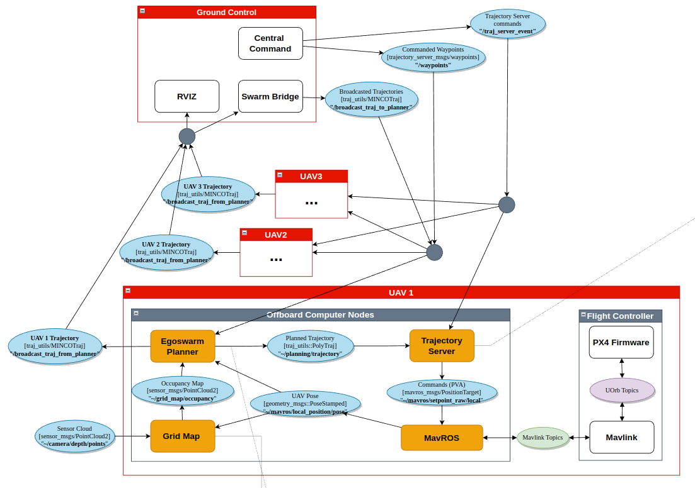

# gestelt
A swarm-focused path planning framework. 

For simulation and deployment on a physical drone, PX4 is the firmware of choice, although it is possible to remap the topics for use with Ardupilot or any other Mavlink-compatible firmware.

# Architecture


# Installation and Setup for Simulation
1. Install dependencies
```bash
# Install ROS (if not done)
sudo apt install ros-noetic-desktop-full

# Install other dependencies
sudo apt install git build-essential tmux python3-catkin-tools python3-vcstool xmlstarlet -y
sudo apt install ros-${ROS_DISTRO}-mavlink ros-${ROS_DISTRO}-mavros ros-${ROS_DISTRO}-mavros-msgs ros-${ROS_DISTRO}-mavros-extras -y
```

2. Clone repositories
```bash
mkdir -p ~/gestelt_ws/src/
cd ~/gestelt_ws/src
git clone https://github.com/JohnTGZ/gestelt.git -b min_snap
cd gestelt
vcs import < simulators.repos --recursive
vcs import < thirdparty.repos --recursive
```

3. Install PX4 firmware
```bash
# cd to PX4-Autopilot repo
cd ~/gestelt_ws/PX4-Autopilot
bash ./Tools/setup/ubuntu.sh 
# Make SITL target for Gazebo simulation
DONT_RUN=1 make px4_sitl gazebo-classic

# Copy the custom drone model over
cp -r ~/gestelt_ws/src/gestelt/gestelt_bringup/simulation/models/raynor ~/gestelt_ws/PX4-Autopilot/Tools/simulation/gazebo-classic/sitl_gazebo-classic/models/

# for PX4 V1.13.0
cp -r ~/gestelt_ws/src/gestelt/gestelt_bringup/simulation/models/raynor ~/gestelt_ws/PX4-Autopilot/Tools/sitl_gazebo/models/


# [EMERGENCY USE] IF you screw up the PX4 Autopilot build at any point, clean up the build files via the following command:
make distclean
```

4. Building the workspace
```bash
# Assuming your workspace is named as follows
cd ~/gestelt_ws/

# Building for debugging/development
catkin build
# Building for release mode (For use on Radxa)
catkin build -DCMAKE_BUILD_TYPE=Release
```

# Quick start
There are 2 scripts you can use to run an example simulation. 

## 1. Run PX4 SITL with Gazebo. 
The first script runs a simulated PX4 SITL instance with Gazebo, with physics. This should be tested before deployment on an actual drone. It runs the following:
1. Gazebo simulation environment.
2. Trajectory Server.
3. Minimum Snap Trajectory Planner and Sampler.
4. Mission commands.
```bash
cd ~/gestelt_ws/src/gestelt/gestelt_bringup/scripts
# Run the script, the script sources all the relevant workspaces so you don't have to worry about sourcing. 
./sitl_drone_bringup.sh

# To kill everything, use the following command
killall -9 gazebo; killall -9 gzserver; killall -9 gzclient; killall -9 rosmaster; tmux kill-server;

# IF you want to add a shortcut to kill the simulation you can add the following to ~/.bashrc
alias killbill="killall -9 gazebo; killall -9 gzserver; killall -9 gzclient; killall -9 rosmaster; tmux kill-server;
```
5. If you want to change the planning setpoints:
- The mission source code is in [mission.py](gestelt_bringup/src/mission.py)
    - Here, the quadrotor is commanded to take off, enter mission mode and are given goal points.
- The trajectory planner source code is in [example_planner.cc](trajectory_planner/src/example_planner.cc)
    - Here, given a goal point, a minimum snap trajectory is planned
- The trajectory sampler source code is in [trajectory_sampler.cpp](trajectory_planner/src/trajectory_sampler.cpp)
    - Here, given a minimum snap trajectory, the points are sampled and sent to the Trajectory server.
- The trajectory execution source code is in [traj_server.cpp](trajectory_server/src/traj_server.cpp)
    - Here, each individual setpoint is converted to PVA commands and sent to the quadrotor.
    - The function in charge of converting the minimum snap point to PVA point is `void TrajServer::multiDOFJointTrajectoryCb(const trajectory_msgs::MultiDOFJointTrajectory::ConstPtr &msg)`
- Refer to the architecture above for more information on how they are connected.

## 2. Run a fake physics-less drone simulation
The second one is a fake drone with no physics and be used to test the architecture or algorithm. It runs the following:
1. Fake drone simulation.
2. Trajectory Server.
3. Minimum Snap Trajectory Planner and Sampler.
4. Mission commands.

# Acknowledgements
1. [EGO-Planner-V2 repo](https://github.com/ZJU-FAST-Lab/EGO-Planner-v2)
2. [ETHZ-ASL/mav_trajectory_generation](https://github.com/ethz-asl/mav_trajectory_generation)
