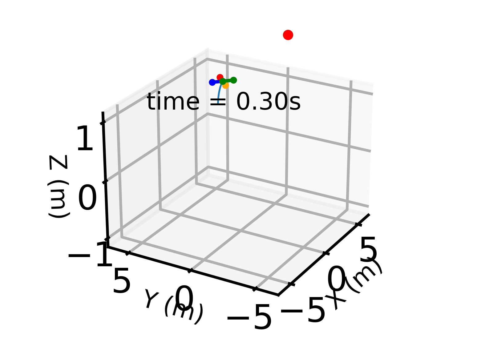
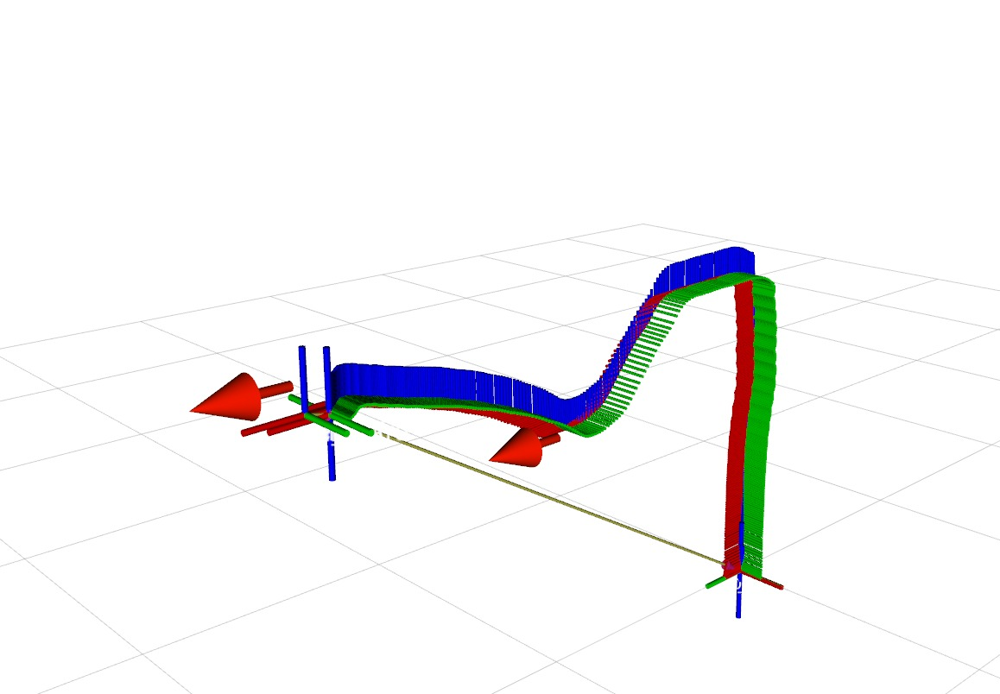

# MPC Explanation

## Please refer to the slide below for the overview of the MPC code and results 
(20_Feb 2024 version) 
https://nusu-my.sharepoint.com/:p:/g/personal/e1101704_u_nus_edu/ETM5ynQhbRdOqy55M0uoRwkBECQjI_HhbMvuEyHjkYPTJw?e=TvpCtM
## Two kinds of simulations
1. **python simulation:**\


2. **Gazebo PX4_SITL simulation:**


## Installation of the ACADOS
1. Please refer to the [LearningAgileFlight_SE3](https://github.com/BinghengNUS/LearningAgileFlight_SE3) to install the python dependency. for the **python simulation**.
2. Please refer to the main `README.md` to install dependence, for the **Gazebo PX4_SITL simulation**. (optional, there are resources on the Internet about how to configure the PX4 sitl)

2. The `acados_template` is the required by the `acados` framework, also you need to install `acados` and setup the environment, please refer to [acados installation](https://docs.acados.org/installation/index.html)
## 1. The MPC problem definition is modified from the work [LearningAgileFlight_SE3](https://github.com/BinghengNUS/LearningAgileFlight_SE3), in the folder :

```plaintext
gestelt_bringup/
├── src/
│   ├── learning_agile_agent.py
│   ├── c_generated_code
│   ├── acados_template
│   ├── quad_OC.py
│   ├── quad_policy.py
│   ├── quad_model.py
│   ├── ...
```
where:
1. `learning_agile_agent.py` is the main file for constructing the MPC solver and running the **python simulation**.

2. In the `quad_OC.py`
    1. The function `acadosOcpSolverInit` constructs the solver and generated the C code. 
        The generated C code of the solver works as a shared library, saved in the folder `c_generated_code`. This shared library will be linked with the MPC ROS wrapper (The package `/learning_agile`). This C++ ROS node will request the solver during both the **Gazebo SITL simulation** and the **real flight**.
    3. The function `acadosOcpSolver` calls the generated solver to solve the problem, for the **python simulation**
    4. Noted that I keep both pure `CasADi` solver and `acados` solver for the comparison. Also, I leave both solvers auxiliary functions. I will clean this `CasADi` version in the later code.
    
3. In the `quad_model.py`
    1. MPC cost function and the Drone Dynamic in `CasADi` symbolic function format is defined. `acados` will use the symbolic function as well.
4. In the `quad_policy.py`
    1. the initialization of the class `run_quad` will define: 
        1. the initial state of the drone for the **python simulation**.  
        2. the drone dynamics values.
        3. the weight of each cost term.
        4. initialize the the solver.

5. **Each time after modifying the MPC problem definition, like the weight and the model parameters, you need to run the `learning_agile_agent.py` to regenerate the solver. The script will also compile the MPC ROS wrapper to relink the solver shared library.** (I will refine the procedure)
## 2. The MPC ROS node/wrapper is in the package:
```plaintext
learning_agile/
├── src/
│   ├── learning_agile_node.cpp (useless now)
│   ├── learning_agile.cpp
```
1. The MPC ROS wrapper is in the file `learning_agile.cpp`, it is not a single ROS node, instead, this class will be called by the node `traj_server` by using the shared pointer.

## 3. The FSM for safety protection
```plaintext
trajectory_server/
├── src/
│   ├── traj_server_node.cpp 
│   ├── traj_server.cpp

```
1. This node manages the drone flight state, from `ARM`->`Take-Off`->`Hover`->`MPC`
2. if the `MPC` has no solution, or the period is too long, the `traj_server` will switch the drone back to `Hover` and the `MPC` will never be called.
## 4. Running the Gazebo SITL simulation and the real flight.
## 4.1. The simulation
1. All scripts are in the folder:
    ```plaintext
    gestelt_bringup/
    ├── script/
    │   ├── ...

    ```
2. I provide two kind of Gazebo PX4_SITL simulations.   
    1. **All in PC.** 
        This simulation will run both `PX4_SITL` and `MPC`in the PC.
        run `./sitl_bringup_learning_agile.sh`
    2. **HITL simulation**
        One critical issue is to verify whether the drone onboard computer could run the MPC in the desired frequency or not, so here I provided the **HITL** simulation:
        
        1. Your PC will run the `PX4_SITL` and `Gazebo` by running:
        `./sitl_bringup_learning_agile_laptop_distributed.sh` 
        2. Connect the drone with the PC by wifi, run:
        `./sitl_bringup_learning_agile_drone_distributed.sh`
## 4.2 Real flight:
1. ssh on the drone, run:
`./realflight_bringup_learning_agile_drone.sh`
2. On your PC, run: `./realflight_bringup_learning_agile_record_remote.sh`  


## 4.3 Log
Both simulation and real flight logs are in folder, please `mkdir` of it.
 ```plaintext
    gestelt_bringup/
    ├── data/
    │   ├── ...

```