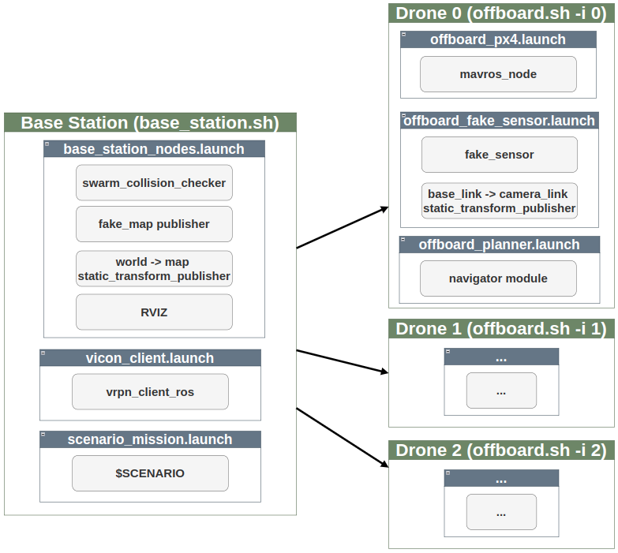

# File Hierarchy 

## Launch files

- fake_drone: For simulated drones (without dynamics)
- sitl: For Gazebo simulated drones
- offboard: For actual drone deployment 
- rosbag: Rosbag recording
- rviz: RVIZ Visualization helper files
- scenarios: Hosts a set of scenario spawn configurations for use with fake_drone

# Demo 

## scripts


- `base_station.sh`: Base station nodes
    - `base_station_nodes.launch`
        - swarm_collision_checker
        - fake_map_publisher: Publishes the a "fake_map" which is a point cloud that acts as an obstacle representation
        - world->map static_transform_publisher: Broadcasts TF between world and map.
        - RVIZ: Visualization app
    - `vicon_client.launch`
        - vrpn_client_ros: VICON client for receiving vicon pose/orientation of drones
    - `scenario_mission.launch`
        - Launch mission script which publishes navigation goals to all drones via the topic `/drone{i}/planner_adaptor/goals`
- `offboard.sh`: Script for starting up all required nodes on an actual drone:
    - `offboard_px4.launch`
        - mavros_node
    - `offboard_fake_sensor.launch`
        - fake_sensor: Acts as a virtual depth camera, outputs a point cloud readout based on the current orientation and pose of the drone. Uses the "fake_map" as an obstacle reference.
        - base_link -> camera_link static_transform_publisher: Broadcasts TF between drone base_link and camera_link.
    - `offboard_planner.launch`
        - navigator module

## Launching demos
```bash
# On the base station 
./base_station -s <SCENARIO>

# On the drones
./offboard.sh -i <DRONE_ID>
```
