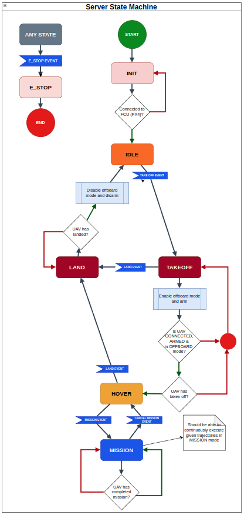
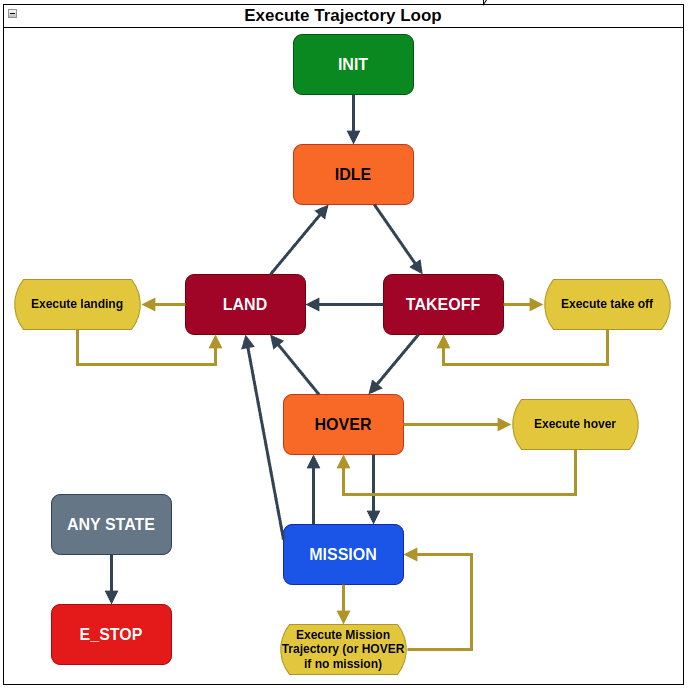

# Trajectory Server

# Operation
1. EVENTS Trigger STATE transtitions

2. 2 loops are running in parallel

    - `Execute trajectory loop`: Handles execution of trajectories. Simply executes trajectories in a loop based on what state the state machine is current in.

    - `State machine loop`: Handles transition between state machine states. The transitions are triggered by EVENTS, and the conditions for transitioning are checked by boolean statements.

# Safety
For safety, we can set `enable_safety_box` parameter to `true`, which will result in only publishing positional commands within the bounds of `safety_box/min` and `safety_box/max`.
